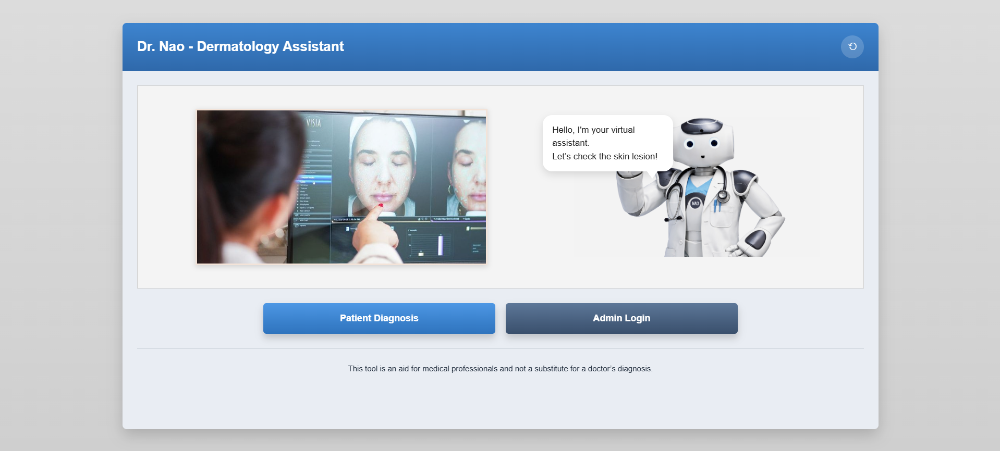
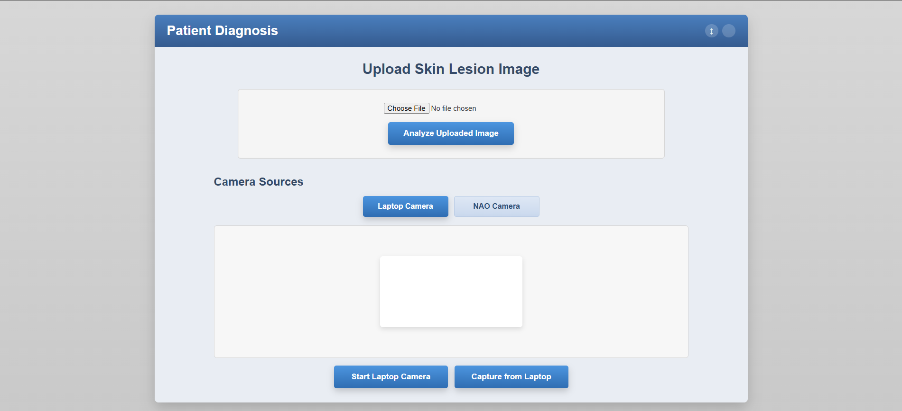
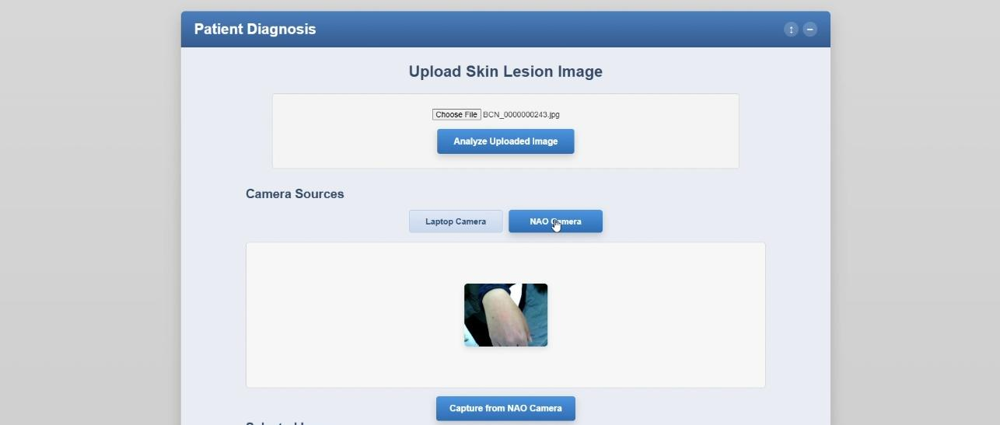
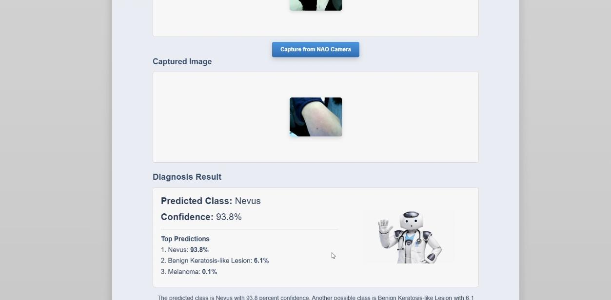
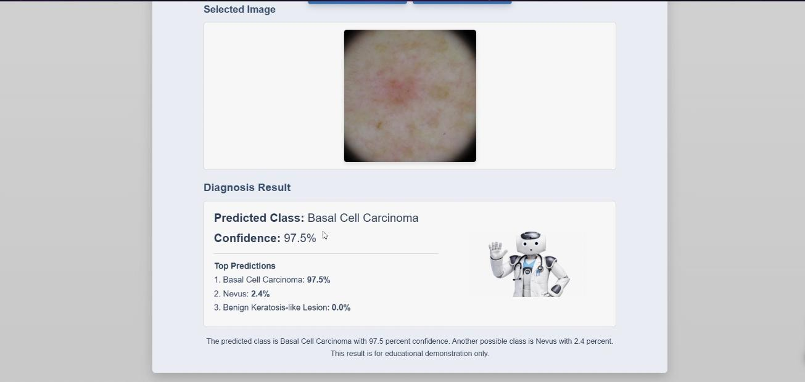

# Dr. Nao - Dermatology Assistant

An educational robotics and AI demonstration project that combines the **NAO humanoid robot**, a **web-based dermatology interface**, and a **pre-trained skin lesion classification model** to create an interactive assistant for skin lesion image analysis.

This project was developed as a demonstration-oriented academic prototype showing how robotics, computer vision, and medical AI can be integrated into a single interactive workflow.

---

## Overview

**Dr. Nao - Dermatology Assistant** allows a user to:

- upload a skin lesion image through a web interface
- capture an image from a laptop camera
- capture an image from a NAO-connected camera pipeline
- run image classification using a pre-trained dermatology model
- display the predicted lesion class with confidence scores
- present the result visually in the interface
- generate a spoken-style explanation through the NAO interaction flow

The system is designed for **educational demonstration purposes only** and is intended to showcase human-robot interaction combined with AI-based image analysis.

---

## Key Features

- Interactive web-based diagnosis interface
- Support for uploaded skin lesion images
- Laptop camera capture workflow
- NAO camera capture workflow
- Skin lesion prediction with top-ranked class probabilities
- NAO-oriented interaction and speech pipeline
- Clean demonstration flow for academic presentations and exhibitions

---

## Project Screenshots

### Home Interface


### Upload and Camera View


### NAO Camera Capture View


### Diagnosis Result - Nevus Example


### Diagnosis Result - Basal Cell Carcinoma Example


---

## Project Structure

```text
.
├── nao.py
├── nao_camera_server/
│   └── server.py
├── skin_nao_demo/
│   ├── inference.py
│   ├── labels.json
│   ├── main.py
│   ├── model.py
│   ├── nao_speaker.py
│   ├── predictor.py
│   └── test_predictor.py
├── skinnaoweb/
│   ├── index.html
│   └── other frontend assets
├── assets/
│   └── screenshots/
│       ├── home-interface.png
│       ├── upload-and-camera-view.png
│       ├── nao-camera-capture-view.jpeg
│       ├── nao-camera-result-nevus.jpeg
│       └── diagnosis-result-bcc.jpeg
├── requirements.txt
├── .gitignore
└── README.md
````

---

## System Workflow

1. The user opens the web interface.
2. The user either:

   * uploads a skin lesion image, or
   * captures an image from the laptop camera, or
   * captures an image from the NAO camera workflow.
3. The backend processes the image.
4. The image is passed to the pre-trained skin lesion classification model.
5. The predicted class and confidence scores are returned.
6. The result is displayed on the web interface.
7. A NAO-compatible explanation or speech output can be triggered as part of the demo flow.

---

## Technologies Used

* **Python**
* **FastAPI / backend serving components**
* **HTML / CSS / JavaScript**
* **PyTorch**
* **NAOqi / NAO integration workflow**
* **Computer vision and image preprocessing**
* **Web-based interaction interface**

---

## Model Attribution

This project uses a pre-trained skin lesion classification model from:

**iamhmh / derm-cnn-ham10000**
[https://huggingface.co/iamhmh/derm-cnn-ham10000](https://huggingface.co/iamhmh/derm-cnn-ham10000)

The project uses that model as part of an educational demonstration workflow for skin lesion image analysis. The original model page states that the **model weights are licensed under CC BY-NC 4.0** and the **code is licensed under MIT**. Please review the original source and its license terms before reuse or redistribution.

---

## Important License and Usage Notice

This repository is shared in a **clean academic/demo form**.

* The pre-trained model file is **not included** in this repository.
* Users should download the model from the original upstream source when needed.
* The upstream model weights are marked for **non-commercial use** on the source page.

Accordingly, this project should be treated as:

* educational
* academic
* demonstration-oriented
* non-commercial

---

## Medical Disclaimer

This project is intended for **educational and demonstration purposes only**.

It is **not** a medical device and must **not** be used for:

* medical diagnosis
* treatment decisions
* clinical decision-making
* professional dermatological judgment

The upstream model page also includes a diagnostic-use disclaimer, so any use of this system should remain strictly within safe educational/demo boundaries.

---

## Setup Instructions

### 1. Clone the repository

```bash
git clone https://github.com/ghayda-njaafreh/skin_nao_demo.git
cd skin_nao_demo
```

### 2. Create and activate a virtual environment

#### Windows

```bash
python -m venv .venv
.venv\Scripts\activate
```

#### Linux / macOS

```bash
python3 -m venv .venv
source .venv/bin/activate
```

### 3. Install dependencies

```bash
pip install -r requirements.txt
```

### 4. Download the model weights

Download the required trained model weights from the original source:

`https://huggingface.co/iamhmh/derm-cnn-ham10000`

Then place the downloaded model file in the local path expected by the prediction code, and update the path in the source code if needed for your environment.

> Note: the model file is intentionally not included in this repository.

### 5. Configure local paths and device-specific settings

Before running the project, update local configuration values inside the code such as:

* `NAO_IP`
* `PYTHON2_PATH`
* `NAO_CAMERA_SERVER_URL`
* `YOUR_BACKEND_IP`
* any local SDK or runtime paths

Example placeholders:

```python
NAO_IP = "YOUR_NAO_IP"
PYTHON2_PATH = r"C:\Path\To\Python27\python.exe"
NAO_CAMERA_SERVER_URL = "http://YOUR_NAO_CAMERA_SERVER_IP:5000/snapshot"
```

### 6. Run the backend

From the project directory, run the backend server:

```bash
uvicorn skin_nao_demo.main:app --reload
```

### 7. Open the web interface

Open the frontend file from the `skinnaoweb` folder in your browser, or serve it locally using a simple static server if needed.

---

## Notes for NAO Integration

This project includes a NAO-oriented interaction pipeline. To use it correctly, you may need:

* a configured NAO robot or virtual environment
* compatible Python / SDK setup for NAO communication
* correct network IP configuration
* proper local runtime paths for robot communication scripts

Because NAO environments differ between machines, some paths and settings must be adjusted manually for your device.

---

## What Is Included in This Repository

Included:

* source code
* frontend interface
* backend logic
* prediction pipeline code
* NAO interaction scripts
* screenshots
* documentation

Not included:

* pre-trained model weights
* runtime logs
* temporary uploads
* captured user images
* private environment files

---

## Contributors

This project was developed by:

* **ghayda-njaafreh**
* **shadarawa**

---

## Academic / Demonstration Context

This project was developed as an academic-style prototype demonstrating how:

* humanoid robotics
* AI-based image classification
* interactive web systems
* medical-themed assistive interfaces

can be combined into one integrated demonstration platform.

It is especially suitable for:

* university demos
* academic exhibitions
* robotics presentations
* AI demonstration events

---

## Future Improvements

Possible future directions include:

* improved UI/UX design
* live NAO voice interaction enhancements
* better deployment packaging
* configurable model loading
* multi-model comparison
* safer and more modular medical-AI demo workflows
* stronger environment configuration handling

---

## Citation / Acknowledgment

If you use or adapt this project for an academic demonstration, please also acknowledge the original upstream model source:

**iamhmh / derm-cnn-ham10000**
[https://huggingface.co/iamhmh/derm-cnn-ham10000](https://huggingface.co/iamhmh/derm-cnn-ham10000)

---

## Contact

For academic/demo collaboration or project discussion, please use the repository issues section or your preferred GitHub contact method.
